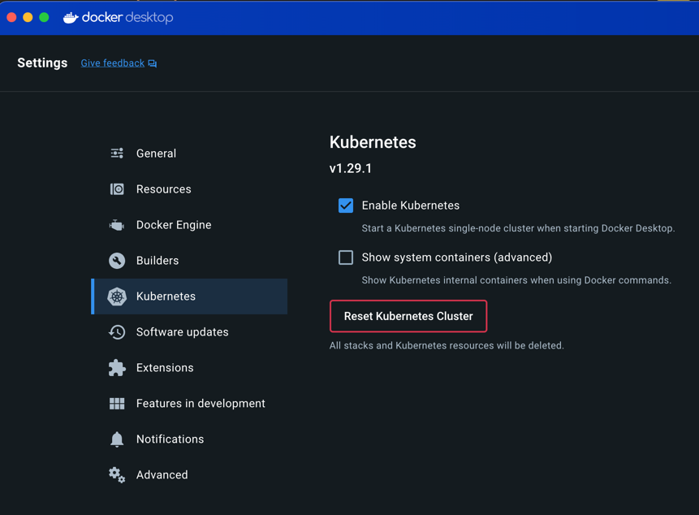

[Вернуться][main]

---

# Production-Ready микросервисы

На данный момент у вас есть микросервисная архитектура на Python, работающая на вашей машине разработки, которая отлично
подходит для тестирования. В этом разделе мы запустим ее в облаке.

## Docker

Docker - это удивительная технология, позволяющая изолировать группу процессов от других процессов на той же машине. У
вас может быть две или более групп процессов с собственными файловыми системами, сетевыми портами и так далее. Можно
представить это как виртуальное окружение Python, но для всей системы и более безопасную.

Docker идеально подходит для развёртывания микросервиса Python, потому что вы можете упаковать все зависимости и
запустить микросервис в изолированной среде. Когда вы развертываете свой микросервис в облаке, он может работать на
одной машине с другими микросервисами, не наступая друг другу на пятки. Это позволяет лучше использовать ресурсы.

В этом семинаре мы не будем углубляться в Docker, потому что это заняло бы целую книгу и основы мы с вами обсуждали в
прошлом году. Вместо этого вы просто развернёте микросервисы Python в облаке.

Вы создадите два образа Docker, один для микросервиса Marketplace, а другой для микросервиса Recommendations. Образ -
это, по сути, файловая система плюс некоторые метаданные. По сути, каждый из ваших микросервисов будет иметь собственное
мини-окружение Linux. Она может записывать файлы, не затрагивая реальную файловую систему, и открывать порты, не
конфликтуя с другими процессами.

Для создания образов необходимо определить Dockerfile. Вы всегда начинаете с базового образа, в котором есть некоторые
базовые вещи. В данном случае базовый образ будет включать интерпретатор Python. Затем вы скопируете файлы с вашей
машины разработки в образ Docker. Вы также можете запускать команды внутри образа Docker. Это полезно для установки
зависимостей.

### Докер-файл Recommendations

Начните с создания Docker-образа микросервиса Recommendations. Создайте recommendations/Dockerfile и добавьте следующее:

```Dockerfile
FROM python

RUN mkdir /service
COPY protobufs/ /service/protobufs/
COPY recommendations/ /service/recommendations/
WORKDIR /service/recommendations
RUN python -m pip install --upgrade pip
RUN python -m pip install -r requirements.txt
RUN python -m grpc_tools.protoc -I ../protobufs --python_out=. --grpc_python_out=. ../protobufs/recommendations.proto

EXPOSE 50051
ENTRYPOINT [ "python", "recommendations.py" ]
```

Вот построчное описание:

- Строка 1 инициализирует ваш образ с базовым окружением Linux плюс последняя версия Python. На данный момент ваш образ
  имеет типичное расположение файловой системы Linux. Если бы вы заглянули внутрь, там были бы /bin, /home и все
  основные файлы, которые вы могли бы ожидать.

- В строке 3 создается новый каталог `/service`, в котором будет находиться код вашего микросервиса.

- Строки 4 и 5 копируют каталоги `protobufs/` и `recommendations/` в `/service`.

- Строка 6 дает `Docker` указание `WORKDIR /service/recommendations`, что похоже на выполнение `cd` внутри образа. Любые
  пути,
  которые вы указываете `Docker`, будут относительными к этому местоположению, и когда вы запускаете команду, она будет
  выполняться в этом каталоге.

- В строке 7 обновляется `pip`, чтобы избежать предупреждений о старых версиях.

- Строка 8 указывает `Docker` на необходимость запустить `pip install -r requirements.txt` внутри образа. Это добавит в
  образ все файлы `grpcio-tools` и любые другие пакеты, которые вы можете добавить. Обратите внимание, что вы не
  используете виртуальное окружение, потому что в нем нет необходимости. Единственное, что будет запущено в этом
  образе - это ваш микросервис, поэтому вам не нужно дополнительно изолировать его окружение.

- В строке 9 выполняется команда `python -m grpc_tools.protoc` для генерации Python-файлов из файла `protobuf`. После
  чего
  ваш каталог `/service` внутри образа будет выглядеть следующим образом:

```
/service/
|
├── protobufs/
│   └── recommendations.proto
|
└── recommendations/
    ├── recommendations.py
    ├── recommendations_pb2.py
    ├── recommendations_pb2_grpc.py
    └── requirements.txt
```

- Строка 12 сообщает `Docker`, что вы собираетесь запустить микросервис на порту `50051` и хотите выставить его за
  пределы
  образа.

- Строка 13 указывает `Docker`, как запустить ваш микросервис.

Теперь вы можете сгенерировать образ Docker из вашего Dockerfile. Выполните следующую команду из каталога, содержащего
весь ваш код - не внутри каталога recommendations/, а на один уровень выше от него:

```sh
docker build . -f recommendations/Dockerfile -t recommendations
```

Это позволит собрать образ Docker для микросервиса Recommendations. Вы должны увидеть некоторые результаты, как Docker
собирает образ. Теперь вы можете запустить его:

```sh
docker run -p 127.0.0.1:50051:50051/tcp recommendations
```

Вы не увидите никаких результатов, но ваш микросервис "Рекомендации" теперь работает внутри контейнера Docker. Когда вы
запускаете образ, вы получаете контейнер. Вы можете запустить образ несколько раз, чтобы получить несколько контейнеров,
но образ все равно будет только один.

Параметр `-p 127.0.0.1:50051:50051/tcp` указывает Docker перенаправлять TCP-соединения на порт `50051` на вашей машине
на
порт `50051` внутри контейнера. Это дает вам возможность гибко перенаправлять различные порты на вашей машине.

Например, если вы запускаете два контейнера, в которых работают микросервисы Python на порту `50051`, то вам нужно будет
использовать два разных порта на хост-машине. Это связано с тем, что два процесса не могут открыть один и тот же порт
одновременно, если они не находятся в разных контейнерах.

### Докерфайл Marketplace

Далее вы создадите образ Marketplace. Создайте `marketplace/Dockerfile` и добавьте следующее:

```Dockerfile
FROM python

RUN mkdir /service
COPY protobufs/ /service/protobufs/
COPY marketplace/ /service/marketplace/
WORKDIR /service/marketplace
RUN python -m pip install --upgrade pip
RUN python -m pip install -r requirements.txt
RUN python -m grpc_tools.protoc -I ../protobufs --python_out=. --grpc_python_out=. ../protobufs/recommendations.proto

EXPOSE 5000
ENV FLASK_APP=marketplace.py
ENTRYPOINT [ "flask", "run", "--host=0.0.0.0"]
```

Он очень похож на Dockerfile рекомендаций, но имеет несколько отличий:

- В строке 13 используется `ENV FLASK_APP=marketplace.py` для установки переменной окружения `FLASK_APP` внутри образа.
  Она
  нужна `Flask` для запуска.
- Строка 14 добавляет `--host=0.0.0.0` к команде `flask run`. Если вы не добавите это, то `Flask` будет принимать
  соединения
  только с `localhost`.

Но подождите, разве вы все еще не запускаете все на `localhost`? Ну, не совсем. Когда вы запускаете контейнер `Docker`,
он
по умолчанию изолирован от хост-машины. `localhost` внутри контейнера отличается от `localhost` снаружи, даже на одной и
той
же машине. Поэтому вам нужно указать `Flask` принимать соединения из любого места.

Откройте новый терминал. Вы можете собрать образ Marketplace с помощью этой команды:

```sh
docker build . -f marketplace/Dockerfile -t marketplace
```

Это создаст образ Marketplace. Теперь вы можете запустить его в контейнере с помощью этой команды:

```sh
docker run -p 127.0.0.1:5000:5000/tcp marketplace
```

Вы не увидите никаких результатов, но ваш микросервис Marketplace теперь работает.

## Работа в сети

К сожалению, несмотря на то, что оба контейнера - `Recommendations` и `Marketplace` - работают, если вы перейдете на
сайт http://localhost:5000 в браузере, то получите ошибку. Вы можете подключиться к микросервису `Marketplace`, но он
больше не может подключиться к микросервису `Recommendations`. Контейнеры изолированы.

К счастью, Docker предлагает решение этой проблемы. Вы можете создать виртуальную сеть и добавить в нее оба контейнера.
Вы также можете задать им DNS-имена, чтобы они могли найти друг друга.

Ниже вы создадите сеть под названием `microservices` и запустите в ней микросервис `Recommendations`. Вы также присвоите
ей
DNS-имя `recommendations`. Сначала остановите запущенные в данный момент контейнеры с помощью `Ctrl+C`. Затем выполните
следующие действия:

```sh
docker network create microservices
docker run -p 127.0.0.1:50051:50051/tcp --network microservices --name recommendations recommendations
```

Команда `docker network create` создает сеть. Это нужно сделать только один раз, после чего к ней можно подключить
несколько контейнеров. Затем в команду `docker run` добавляется параметр `--network microservices`, чтобы запустить
контейнер в этой сети. Параметр `--name recommendations` дает ему рекомендации по DNS-именам.

Перед перезапуском контейнера `marketplace` необходимо изменить код. Это связано с тем, что вы захардкодили
`localhost:50051` в этой строке из `marketplace.py`:

```py
recommendations_channel = grpc.insecure_channel("localhost:50051")
```

Теперь вы хотите подключиться к `recommendations:50051`. Но вместо того, чтобы снова писать хардкод, вы можете
загрузить его из переменной окружения. Замените строку выше следующими двумя:

```py
recommendations_host = os.getenv("RECOMMENDATIONS_HOST", "localhost")
recommendations_channel = grpc.insecure_channel(
    f"{recommendations_host}:50051"
)
```

Это загружает имя хоста микросервиса `Recommendations` в переменную окружения `RECOMMENDATIONS_HOST`. Если она не
задана, то
по умолчанию можно установить `localhost`. Это позволит вам запускать один и тот же код как непосредственно на вашей
машине, так и внутри контейнера.

Вам нужно будет пересобрать образ `marketplace`, поскольку вы изменили код. Затем попробуйте запустить его в своей сети:

```sh
docker build . -f marketplace/Dockerfile -t marketplace
docker run -p 127.0.0.1:5000:5000/tcp --network microservices -e RECOMMENDATIONS_HOST=recommendations marketplace
```

Это похоже на то, как вы запускали его раньше, но с двумя отличиями:

Вы добавили опцию `--network microservices`, чтобы запустить его в той же сети, что и микросервис `Recommendations`. Вы
не
добавили опцию `--name`, потому что, в отличие от микросервиса `Recommendations`, микросервису `Marketplace` не нужно
искать
IP-адрес. Достаточно проброса портов, обеспечиваемого параметром `-p 127.0.0.1:5000:5000/tcp`, и ему не нужно DNS-имя.

Вы добавили `-e RECOMMENDATIONS_HOST=recommendations`, которая устанавливает переменную окружения внутри контейнера. Так
вы передаете имя хоста микросервиса Recommendations в ваш код.

Теперь вы можете снова попробовать запустить `localhost:5000` в браузере, и он должен загрузиться правильно. Ура!

После открытия страницы http://127.0.0.1:5000 в логах запущенного контейнера появится строка:

```sh
172.27.0.1 - - [09/Mar/2024 20:33:28] "GET / HTTP/1.1" 200 -
```

## Docker Compose

Удивительно, что все это можно сделать с помощью `Docker`, но это немного утомительно. Было бы здорово, если бы
существовала одна команда, которую можно было бы запустить для запуска всех контейнеров. К счастью, она есть! Она
называется `docker-compose` и является частью проекта `Docker`.

Вместо того чтобы выполнять кучу команд для сборки образов, создания сетей и запуска контейнеров, вы можете объявить
свои микросервисы в YAML-файле:

```yaml
version: "3.8"
services:

  marketplace:
    build:
      context: .
      dockerfile: marketplace/Dockerfile
    environment:
      RECOMMENDATIONS_HOST: recommendations
    image: marketplace
    networks:
      - microservices
    ports:
      - 5000:5000

  recommendations:
    build:
      context: .
      dockerfile: recommendations/Dockerfile
    image: recommendations
    networks:
      - microservices

networks:
  microservices:
```

Как правило, вы помещаете это в файл docker-compose.yaml. Поместите его в корень вашего проекта:

```
.
├── marketplace/
│   ├── marketplace.py
│   ├── requirements.txt
│   └── templates/
│       └── homepage.html
|
├── protobufs/
│   └── recommendations.proto
|
├── recommendations/
│   ├── recommendations.py
│   ├── recommendations_pb2.py
│   ├── recommendations_pb2_grpc.py
│   └── requirements.txt
│
└── docker-compose.yaml
```

В этом семинаре мы не будем подробно останавливаться на синтаксисе, поскольку он хорошо задокументирован в других
местах. На самом деле он просто делает то же самое, что вы уже делали вручную. Однако теперь вам нужно выполнить всего
одну команду, чтобы поднять сеть и контейнеры:

```sh
docker-compose up
```

После этого вы снова сможете открыть `localhost:5000` в браузере, и все будет работать отлично.

Обратите внимание, что вам не нужно открывать `50051` в контейнере recommendations, если он находится в той же сети, что
и
микросервис `Marketplace`, поэтому эту часть можно опустить.

> Примечание: При разработке с помощью `docker-compose`, если вы измените какой-либо из файлов, запустите
> `docker-compose build`, чтобы пересобрать образы. Если вы запустите `docker-compose up`, будут использоваться
> старые образы, что может привести к путанице и неожиданному поведению работы микросервисов.

Если вы хотите остановить `docker-compose`, чтобы внести некоторые правки, прежде чем двигаться дальше,
нажмите `Ctrl+C`.

## Тестирование

Чтобы провести модульное тестирование (unit) микросервиса на Python, вы можете инстанцировать класс микросервиса и
вызвать его
методы. Вот базовый пример теста для вашей реализации `RecommendationService`:

```py
# recommendations/recommendations_test.py
from recommendations import RecommendationService

from recommendations_pb2 import BookCategory, RecommendationRequest


def test_recommendations():
    service = RecommendationService()
    request = RecommendationRequest(
        user_id=1, category=BookCategory.MYSTERY, max_results=1
    )
    response = service.Recommend(request, None)
    assert len(response.recommendations) == 1
```

Нюансы:

- Строка 6 инстанцирует класс, как и любой другой, и вызывает его методы.
- В строке 11 для контекста передается `None`, что работает до тех пор, пока вы его не используете. Если вы хотите
  протестировать пути кода, использующие контекст, то можете его высмеять.

Интеграционное тестирование включает в себя запуск автоматизированных тестов с несколькими микросервисами, которые не
замакетированы. Так что это немного сложнее, но не слишком сложно. Добавьте файл
`marketplace/marketplace_integration_test.py`:

```py
from urllib.request import urlopen


def test_render_homepage():
    homepage_html = urlopen("http://localhost:5000").read().decode("utf-8")
    assert "<title>Online Books For You</title>" in homepage_html
    assert homepage_html.count("<li>") == 3
```

Здесь выполняется HTTP-запрос к URL домашней страницы и проверяется, что он возвращает HTML с заголовком и тремя
элементами `<li>` в нем. Это не самый лучший тест, поскольку он будет не очень удобен для сопровождения, если
на странице будет больше элементов, но он демонстрирует суть. Этот тест пройдет только в том случае, если микросервис
`Recommendations` работает. Вы даже можете протестировать микросервис `Marketplace`, сделав к нему HTTP-запрос.

Как же запустить этот тип теста? К счастью, добрые люди из Docker также предоставили способ сделать это. Запустив свои
Python-микросервисы с помощью `docker-compose`, вы можете запускать команды внутри них с помощью `docker-compose exec`.
Так,
если вы хотите запустить интеграционный тест внутри контейнера `marketplace`, вы можете выполнить следующую команду:

```sh
docker-compose build
docker-compose up
docker-compose exec marketplace pytest marketplace_integration_test.py
```

Это запустит команду `pytest` внутри контейнера `marketplace`. Поскольку интеграционный тест подключается к `localhost`,
его
нужно запускать в том же контейнере, что и микросервис.

## Развёртывание в Kubernetes

Отлично! Теперь у вас на компьютере работает пара микросервисов. Вы можете быстро поднять их и запустить интеграционные
тесты на обоих. Но вам нужно перевести их в продакшн среду. Для этого вы будете использовать `Kubernetes`.

В этом семинаре мы не будем подробно останавливаться на `Kubernetes`, поскольку это большая тема, и исчерпывающая
документация и руководства доступны в других местах. Тем не менее, в этом разделе вы найдете основы для развёртывания
ваших микросервисов Python на кластере `Kubernetes` в облаке.

> Примечание: Чтобы развернуть образы `Docker` в облаке провайдера, вам нужно отправить свои образы `Docker` в реестр
> образов, например `Docker Hub`.
>
> В следующих примерах в этом семинаре используются образы, которые уже были размещены на `Docker Hub`. Если вы хотите
> изменить их или создать свои собственные микросервисы, то вам нужно будет создать учетную запись на `Docker Hub`,
> чтобы
> иметь возможность отправлять образы. При желании вы также можете создать частный реестр или использовать другой
> реестр.

### Конфиги Kubernetes

Вы можете начать с минимальной конфигурации `Kubernetes` в файле `kubernetes.yaml`. Полный файл немного длинноват, но он
состоит из четырех отдельных секций, поэтому мы рассмотрим их по очереди:

```yaml
---
apiVersion: apps/v1
kind: Deployment
metadata:
  name: marketplace
  labels:
    app: marketplace
spec:
  replicas: 3
  selector:
    matchLabels:
      app: marketplace
  template:
    metadata:
      labels:
        app: marketplace
    spec:
      containers:
        - name: marketplace
          image: hidan/python-microservices-article-marketplace:0.1
          env:
            - name: RECOMMENDATIONS_HOST
              value: recommendations
```

Здесь определяется развёртывание для микросервиса `Marketplace`. Развёртывание указывает `Kubernetes`, как развернуть
ваш
код. `Kubernetes` нужны четыре основные части информации:

1. Какой образ `Docker` развернуть
2. Сколько экземпляров развернуть
3. Какие переменные окружения нужны микросервисам
4. Как идентифицировать ваш микросервис.

Вы можете указать `Kubernetes`, как идентифицировать ваш микросервис, используя метки. Хотя здесь это не показано, вы
также можете указать `Kubernetes`, какие ресурсы памяти и процессора нужны вашему микросервису. Многие другие параметры
можно найти в документации `Kubernetes`.

Вот что происходит в коде:

- Строка 9 указывает `Kubernetes`, сколько подов нужно создать для вашего микросервиса. Pod - это изолированная
  среда выполнения, похожая на легкую виртуальную машину, реализованную в виде набора контейнеров. Настройка реплик: 3
  дает вам три пода для каждого микросервиса. Наличие более чем одного позволяет обеспечить избыточность, что дает
  возможность обновления без простоев, масштабирования, так как вам нужно больше машин, и отказоустойчивости в случае
  выхода из строя одной.

- Строка 20 - это образ Docker для развёртывания. Вы должны использовать образ Docker в реестре образов. Чтобы получить
  образ, его нужно поместить в реестр образов. Инструкции о том, как это сделать, есть при входе в свою учетную запись
  на Docker Hub.

Развёртывание микросервиса "Рекомендации" очень похоже:

```yaml
---
apiVersion: apps/v1
kind: Deployment
metadata:
  name: recommendations
  labels:
    app: recommendations
spec:
  replicas: 3
  selector:
    matchLabels:
      app: recommendations
  template:
    metadata:
      labels:
        app: recommendations
    spec:
      containers:
        - name: recommendations
          image: hidan/python-microservices-article-recommendations:0.1
```

Основное различие заключается в том, что в одном случае используется название `marketplace`, а в
другом - `recommendations`.
Вы также устанавливаете переменную окружения `RECOMMENDATIONS_HOST` для развёртывания `marketplace`, но не для
развёртывания `recommendations`.

Далее вы определяете сервис (**Service**) для микросервиса `Recommendations`. В то время как развёртывание
указывает `Kubernetes`, как
развернуть ваш код, служба указывает ему, как направлять запросы к нему. Чтобы избежать путаницы с термином `service`,
который обычно используется при обсуждении микросервисов, вы будете писать это слово с заглавной буквы, когда будете
использовать его в отношении `Kubernetes Service`.

Вот определение сервиса для `recommendations`:

```yaml
---
apiVersion: v1
kind: Service
metadata:
  name: recommendations
spec:
  selector:
    app: recommendations
  ports:
    - protocol: TCP
      port: 50051
      targetPort: 50051
```

Вот что происходит в определении:

- Строка 48: Когда вы создаете службу, `Kubernetes`, по сути, создает DNS-имя хоста с тем же именем в кластере. Таким
  образом, любой микросервис в вашем кластере может отправить запрос на рекомендации. `Kubernetes` переадресует этот
  запрос одному из подов в вашем развёртывании.

- Строка 51: Эта строка соединяет сервис с развёртыванием. Она указывает Kubernetes пересылать запросы к рекомендациям
  одному из подов в развёртывании рекомендаций. Это должно совпадать с одной из пар ключ-значение в метках
  развёртывания.

Служба marketplace работает аналогично:

```yaml
---
apiVersion: v1
kind: Service
metadata:
    name: marketplace
spec:
    type: LoadBalancer
    selector:
        app: marketplace
    ports:
        - protocol: TCP
          port: 5000
          targetPort: 5000
```

Кроме имен и портов, есть только одно отличие. Вы заметите, что тип: `LoadBalancer` появляется только в `marketplace`
`Service`. Это связано с тем, что `marketplace` должен быть доступен извне кластера `Kubernetes`, в то время как
рекомендации
должны быть доступны только внутри кластера.

> Примечание: В большом кластере с большим количеством микросервисов чаще используется служба `Ingress`, чем служба
> `LoadBalancer`. Если вы разрабатываете микросервисы в корпоративной среде, то, вероятно, именно так и следует
> поступить.

### Развёртывание Kubernetes

Обычно для развёртывания Kubernetes используется облачный провайдер. Существует множество облачных провайдеров, среди
которых Google Kubernetes Engine (GKE), Amazon Elastic Kubernetes Service (EKS) и DigitalOcean.

Если вы развёртываете микросервисы в своей компании, то выбор облачного провайдера, который вы используете, скорее
всего, будет продиктован вашей инфраструктурой. В этом семинаре вы будете запускать `Kubernetes` локально. Почти всё
будет так же, как и при использовании облачного провайдера.

Если вы используете `Docker Desktop` на Mac или Windows, то он поставляется с локальным кластером `Kubernetes`, который
можно включить в меню `Settings`. Откройте `Settings`, нажав на значок `Docker` в системном трее, затем найдите раздел
`Kubernetes` и включите его:



Если вы работаете в Linux, то можете установить `minikube`.

После создания кластера вы можете развернуть свои микросервисы с помощью следующей команды:

```sh
kubectl apply -f kubernetes.yaml
```

На этом развёртывание в Kubernetes завершено. Далее вы узнаете, как отслеживать работу микросервисов Python.

---

[Вернуться][main]


[main]: ../../../README.md "содержание"

